> **💰 Final Project OOP: Expense Tracker Program** 


---

## Team Members

| Nama           | NRP        | 
| ---            | ---        | 
| Muhammad Abid Baihaqi Al Faridzi | 5025241133 |
| Lyonel Oliver Dwiputra         | 5025241145 |
| Hosea Felix Sanjaya            | 5025241177 |

---

## Description

An Expense Tracker is a simple application that helps users monitor and manage their daily expenses. This project provides a basic structure for tracking expenses, categorizing them, and generating reports. It is built with object oriented programming principles in mind, ensuring modularity and maintainability.

---

## Technologies Used

- **Java**: The core programming language used for building the application.
- **Java Servlet**: For handling HTTP requests and responses.
- **Apache Tomcat**: A web server to deploy and run the Java Servlet application.
- **Apache Maven**: For project management and build automation.
- **MySQL**: The database management system used to store user and expense data.
- **HTML/CSS/JavaScript**: For front-end development and user interface design.

---

## Features

- **Authentication system for user login, register, and logout**: Provide secure access to the application.
- **CRUD operations for expenses**: Enable users to create, read, update, and delete their expense records.
- **Search, sort, and filter expenses**: Enable users to easily find and organize their expenses records. For searching, users can find their expense records based on keywords in the title. Sorting, users can sort their expense records by date or amount. Filtering, users can filter their expense records based on expense categories.
- **Real time notification**: Notify users of successful operations or errors.
- **Expense statistics and analytics**: Provide insights into spending habits through charts.
- **Exporting and reporting expenses**: Enable users to export their expense data in PDF format.
- **Dark/light mode toggle**: Enhance user experience with theme options.

---

## Class

- HibernateUtil: A utility class responsible for configuring the Hibernate framework and managing the SessionFactory to handle database connections efficiently.
- UserDao, ExpenseDao, NotificationDao: Data Access Object (DAO) classes designed to encapsulate persistence logic and execute CRUD (Create, Read, Update, Delete) operations on the database.
- User, Expense, Notification: Entity classes (Models) that map directly to the corresponding database tables, representing the core data structure and attributes of the application.

---

## How to Run

### Prerequisites:
- Java Development Kit (JDK 17 or higher)
- Apache Maven installed and configured in system PATH
- Apache Tomcat server (version 7 or higher)
- MySQL database server installed and running

### Installation Steps:
1. Clone the repository:
   ```bash
   git clone https://github.com/abidalfrz/final-project-pemrograman-berorientasi-objek.git
    ```
2. Navigate to the project directory:
   ```bash
   cd final-project-pemrograman-berorientasi-objek/Expense_Tracker
   ```
3. Create a new MySQL database, for example `expense_tracker`.
4. Configure database connection:
   - Open the `src/main/java/util/HibernateUtil.java` file.
   - Update the database URL, username, and password to match your MySQL configuration.
5. Run the application:
   ```bash
   mvn tomcat7:run
   ```
6. Open your web browser and go to:
   ```
   http://localhost:8080/Expense_Tracker
   ```
---

## Screenshots

### Login Page

| Light Mode | Dark Mode |
| :---: | :---: |
| 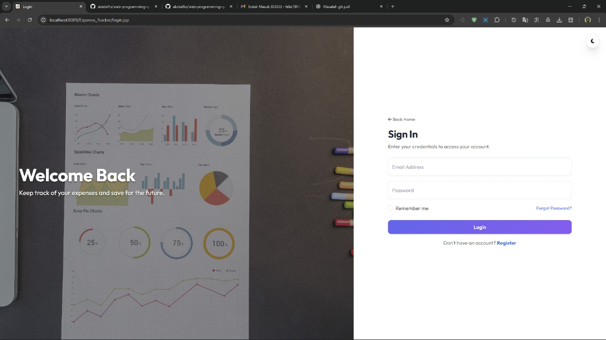 | 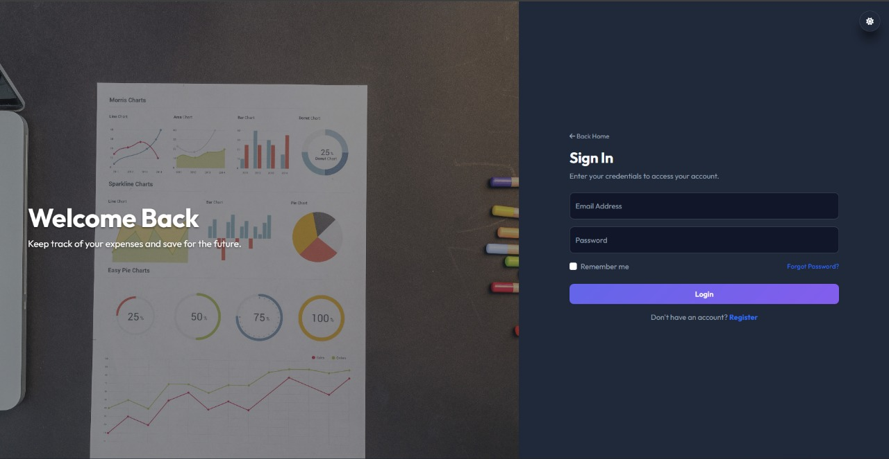 |

### Register Page

| Light Mode | Dark Mode |
| :---: | :---: |
| 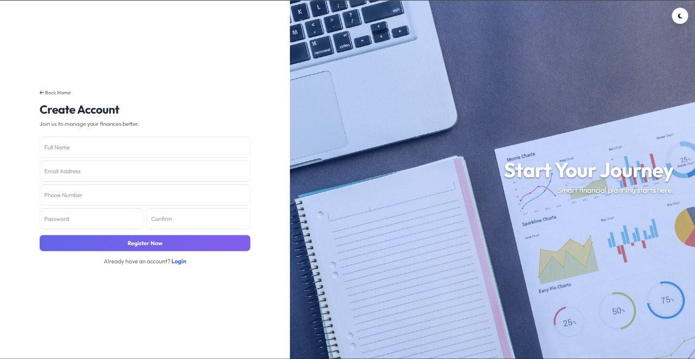 | 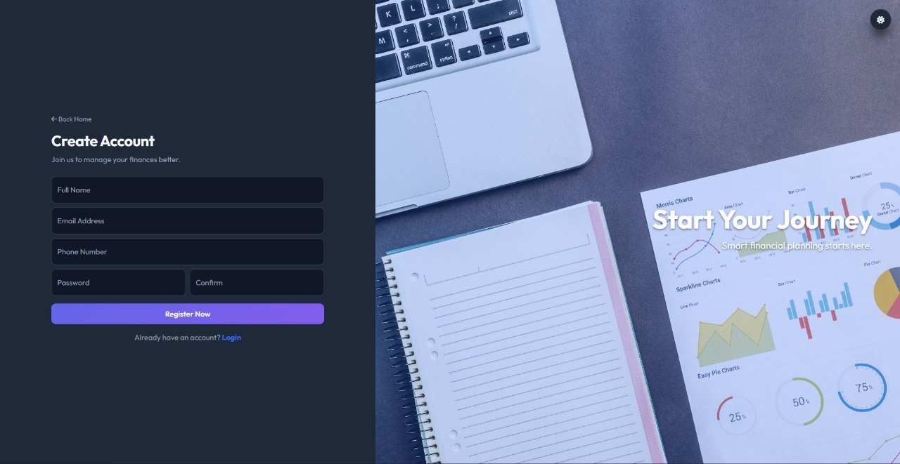 |

### Home Page

| Light Mode | Dark Mode |
| :---: | :---: |
| 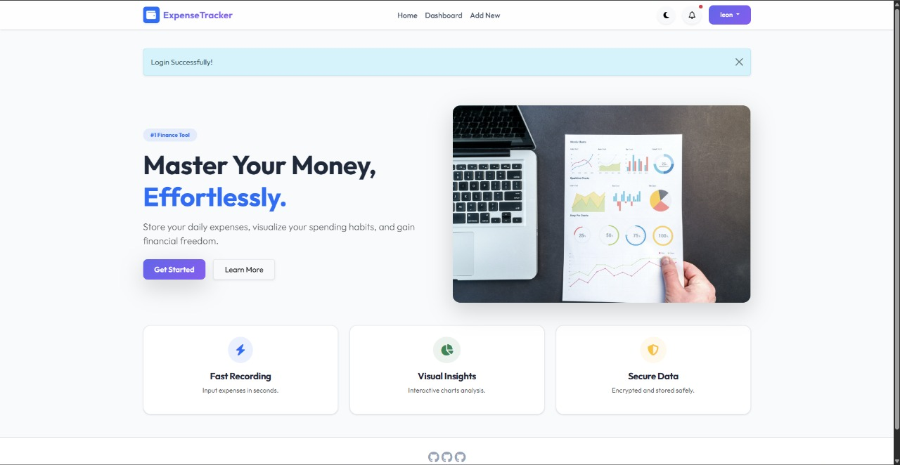 | 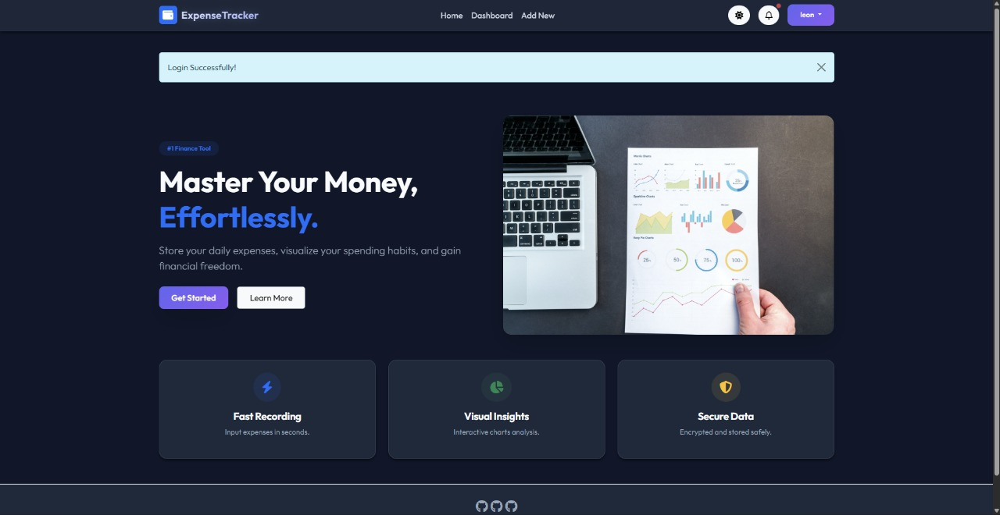 |

### Dashboard Page

| Light Mode | Dark Mode |
| :---: | :---: |
| 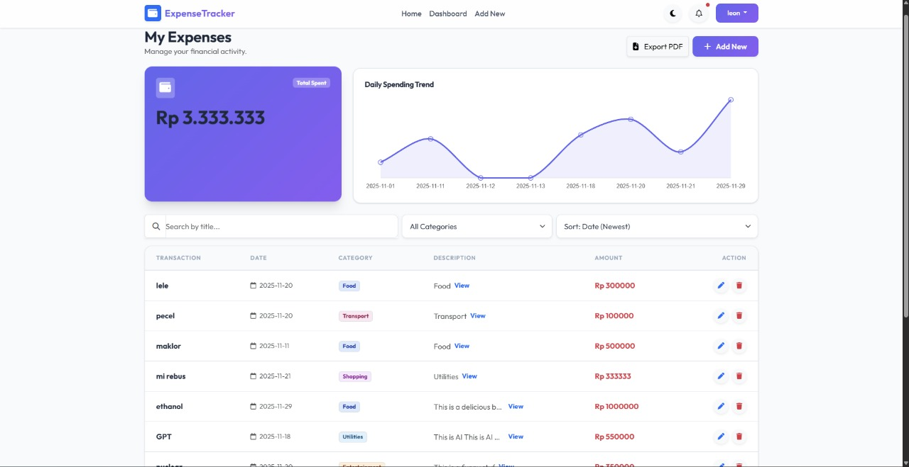 | 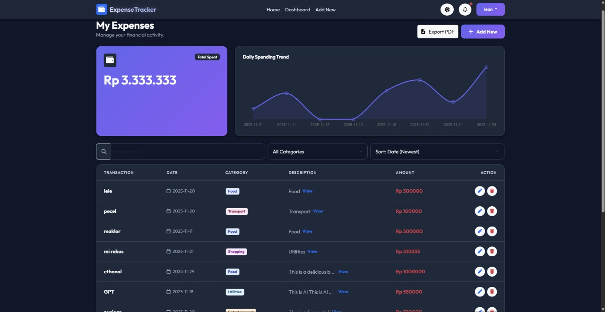 |

### Add Expense Page

| Light Mode | Dark Mode |
| :---: | :---: |
| 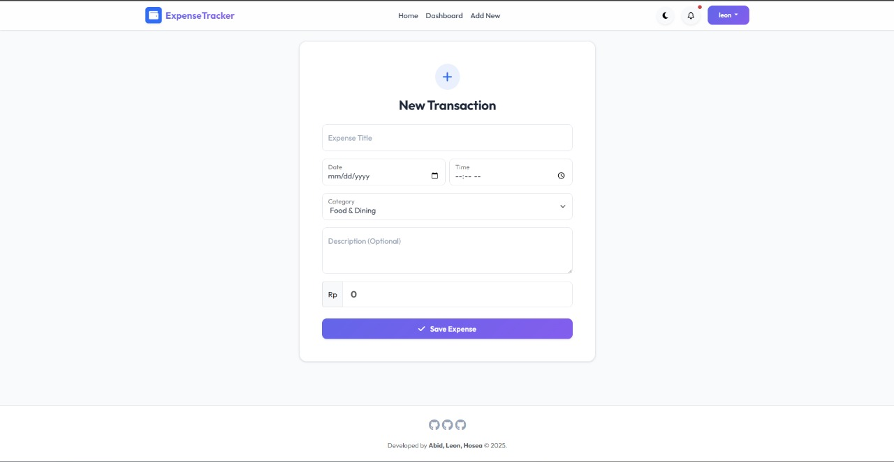 | 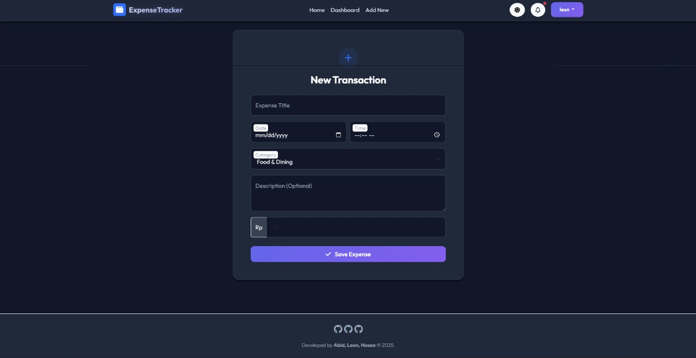 |

### Exported Results

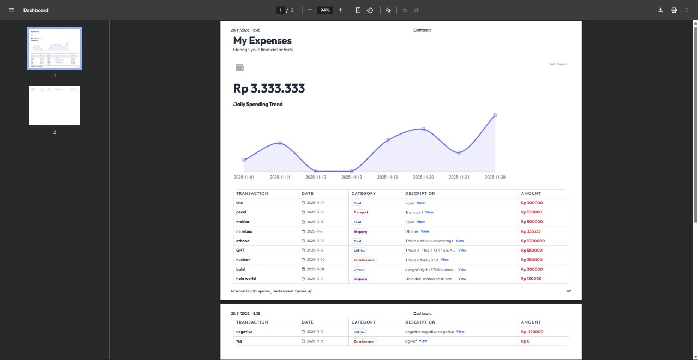

### Link Youtube

https://youtu.be/mZNt2BdwFX0
